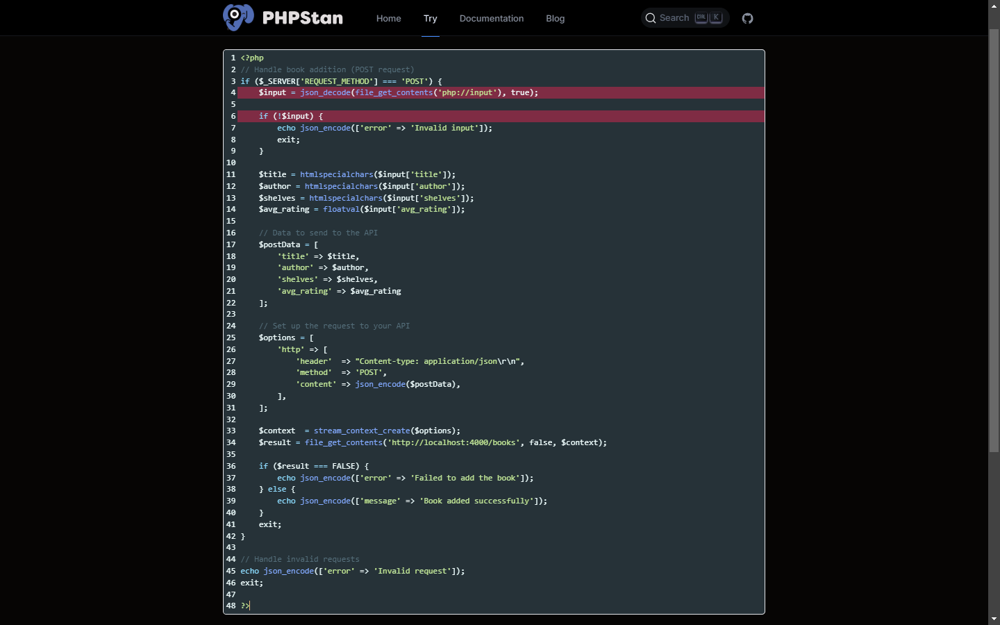
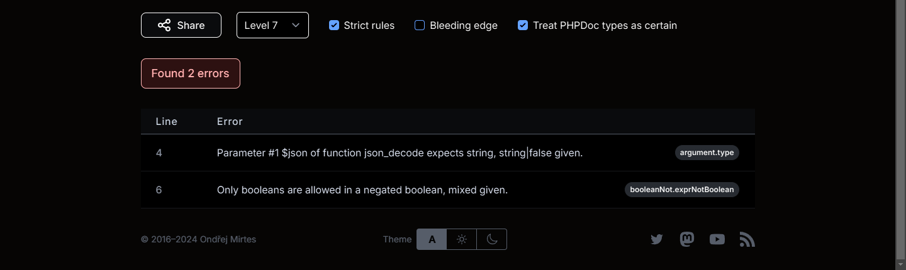
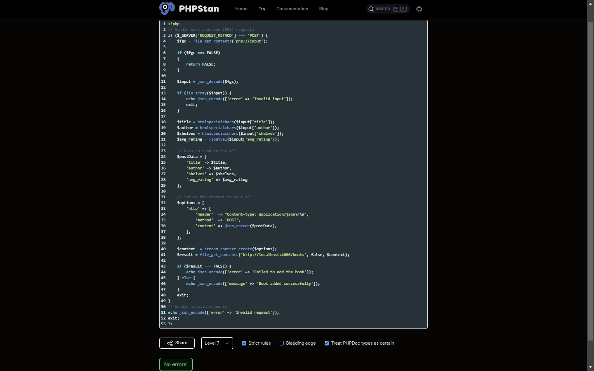

// ***************************************************************
image::SAST Scan Documentation/images/Lil-libraryV3/Add_Books_Fail.PNG
image::images\Lil-libraryV3\Add_Books_Fail_2.png[alt=logout,width=500px] [orientation=portrait]

## Working on this

 [orientation=portrait]
 [orientation=portrait]
 [orientation=portrait]

image::images\ImageTest1.PNG[alt=imagetest,width=500px] [orientation=portrait]
image::images\ImageTest2.PNG[alt=imagetest,width=500px] [orientation=portrait]
image::images\ImageTest3.PNG[alt=imagetest,width=500px] [orientation=portrait]

image::images\ImageFolderTest\ImageTest1.PNG[alt=imagetest,width=500px] [orientation=portrait]
image::images\ImageFolderTest\ImageTest2.PNG[alt=imagetest,width=500px] [orientation=portrait]
image::images\ImageFolderTest\ImageTest3.PNG[alt=imagetest,width=500px] [orientation=portrait]

